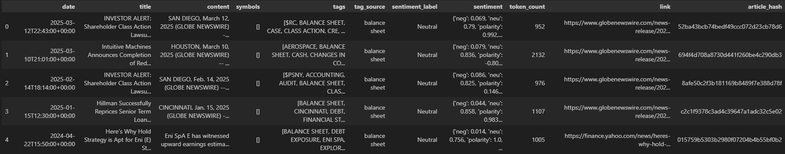
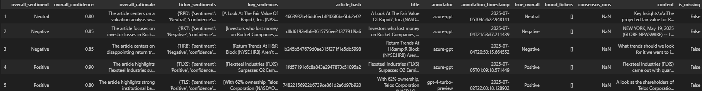

# 📘 Full Project Story – *FinancialSentimentAnalysis*

---

## 📚 Table of Contents

1. [Overview](#overview)
2. [Initial Vision & Proposal](#1-initial-vision--proposal)
3. [Data Collection — Phase I](#2-data-collection--phase-i)
4. [Building a Gold Standard Dataset](#3-building-a-gold-standard-dataset)
5. [Interim Stage — Analysis, EDA & Failures](#4-interim-stage--analysis-eda--failures)
6. [Pipeline Implementation](#5-pipeline-implementation)
7. [Pivot: From Multi-Level to Overall Sentiment](#6-pivot-from-multi-level-to-overall-sentiment)
8. [Modeling & Results](#7-modeling--results)
9. [Technical Challenges](#8-technical-challenges)
10. [Final Report Stage](#9-final-report-stage)
11. [Final Deliverable Summary](#final-deliverable-summary)
12. [Reflection](#reflection)
13. [How to Run the Project](#how-to-run-the-project)
    - [Installation & Setup](#1-installation--setup)
    - [Environment Configuration](#2-environment-configuration)
    - [Running the Pipeline](#3-running-the-pipeline)
    - [Outputs](#4-outputs)
    - [Evaluating Performance](#5-evaluating-performance)
    - [Common Issues & Fixes](#6-common-issues--fixes)
    - [File Structure Overview](#7-file-structure-overview)
    - [Fine-Tuning a LoRA Adapter Model](#8-optional-fine-tuning-a-lora-adapter-model)
14. [Dataset Examples](#dataset-examples)

---

## 🔖 Overview

This project set out to solve a challenging but practically important task: to analyze **financial news articles** and automatically determine their **sentiment** — overall and, ideally, for specific **tickers** and **sectors**. What began as an ambitious multi-component system eventually evolved — through careful iteration, failed experiments, and problem-solving — into a working, high-performing solution for **overall sentiment classification**, built around a fine-tuned FinBERT model using LoRA.

What follows is a chronological, detailed account of everything we did — including what worked, what failed, and why.

---

## 1. 🧠 Initial Vision & Proposal

We started with a **multi-objective plan**:

- Accept raw financial articles (headline + body),
- Automatically extract all **tickers** mentioned in the article,
- Link each ticker to its **sector** using external CSVs,
- Predict sentiment at:
  - Ticker level,
  - Sector level,
  - Article (overall) level,
- Provide a **confidence score** and **rationale** (explanation) for each prediction.

### 🧩 Early Design Decisions

- Planned to use **FinSPID** and **Yahoo Finance** for data,
- Intended to use **Snorkel** for distant supervision (rejected later),
- Chose **FinBERT-NER** for ticker recognition, and **DeBERTa** and **FinBERT** for classification,
- Designed a modular pipeline structure with:
  - `core/` for modeling,
  - `data/` for loading and validation,
  - `scripts/` for orchestration.

---

## 2. 📦 Data Collection — Phase I

We soon faced major problems with data.

### ❌ FINSPID Rejected

- Too narrow, too few samples, no real article bodies.

### ✅ Switched to EODHD API

- Collected 100k financial articles into `financial_news_2020_2025_100k.parquet`,
- Each entry had headline, body, datetime — but all were labeled `"neutral"` by default.

> 💡 **Key Insight:** We couldn’t use this dataset as-is for training or even filtering by sentiment.

---

## 3. 🧹 Building a Gold Standard Dataset

To enable training and evaluation, we generated our own **gold-standard labeled dataset**:

- Used GPT-4 to annotate ~3000 articles with:
  - `overall_sentiment`: Positive / Neutral / Negative,
  - `confidence`,
  - `rationale` (optional),
  - `ticker_sentiments` (eventually dropped).
- Saved in `final_gold_standard_3000.jsonl`.

### 🛑 Problems Encountered:

- Skewed class distribution: 65% Positive, 30% Neutral, 5% Negative,
- Noisy labels: some `"mixed"` or empty,
- Multiple incompatible label field names: `label`, `true_overall`, `overall_sentiment`,
- Evaluation metrics became unreliable unless cleaned manually.

---

## 4. 🧪 Interim Stage — Analysis, EDA & Failures

### ✅ EDA Notebooks

- We created EDA visualizations to explore class distributions and spot label noise.
- Found that many “Neutral” samples had mixed cues, and Positive/Negative were sometimes misclassified.

### ❌ Failed Attempts

- Initial pipeline with LoRA-adapted FinBERT failed completely:
  - Predicted only `Neutral` on every sample,
  - Loss function possibly broken (no gradient),
  - Data pipeline passed wrong label mappings.

### 🩹 Fixes Tried:

- Dropped `"mixed"` samples entirely,
- Balanced classes to reach 3000 samples per class (created final_dataset.jsonl),
- Refactored data loader to normalize field names,
- Verified label distribution per epoch using checkpoints.

---

## 5. ⚙️ Pipeline Implementation

We built a flexible pipeline composed of:

- `data.loader.py`: to load and validate JSONL / Parquet data,
- `core.sentiment.py`: logic for FinBERT, DeBERTa, LoRA support,
- `scripts/run_pipeline.py`: main orchestration entry point,
- `scripts/run_finetuned_pipelines.py`: batch inference with checkpoints.

Other modules:

- `core.text_processor.py`: cleaned headlines and bodies,
- `core.pretrained_financial_ner.py`: attempted FinBERT-NER integration (sidelined),
- `core.aggregator.py`: for combining predictions at sector/ticker levels (later unused),
- `config/settings.py`: held config paths and logging.

---

## 6. 🔁 Pivot: From Multi-Level to Overall Sentiment

Realizing the full pipeline was too ambitious, we narrowed the scope:

- ❌ Dropped per-ticker sentiment,
- ❌ Dropped sector-level sentiment,
- ❌ Dropped rationale and span mapping,
- ✅ Focused 100% on predicting **one sentiment label per article** with confidence.

This decision was crucial to deliver a functioning and testable system by the final stage.

---

## 7. 🧠 Modeling & Results

### ✅ Models Used:

- **VADER** (lexicon baseline),
- **FinBERT** (pretrained),
- **FinBERT-LoRA** (fine-tuned on gold dataset),
- **DeBERTa-LoRA** (alternative transformer model).

### 📊 Final Results:

| Model                   | Macro-F1  | Accuracy  |
|-------------------------|-----------|-----------|
| VADER                   | ~42%      | 53.1%     |
| FinBERT (baseline)      | ~64%      | 64.5%     |
| DeBERTa-LoRA            | 71.8%     | 72.2%     |
| **FinBERT-LoRA (ours)** | **73.3%** | **73.6%** |

---

## 8. 🧰 Technical Challenges

We hit several critical issues:

- Inconsistent labeling caused model collapse,
- Confusion matrix showed **all predictions as Neutral** until we rebalanced data,
- Confidence scores were meaningless (always 0.5) before final fixes.

We documented and fixed each issue progressively.

---

## 9. 🧾 Final Report Stage

We prepared:

- **README.md** with detailed install & run instructions,
- **Performance table** for baselines vs. fine-tuned models,
- **Graphical abstract** (3-panel summary of problem → method → result),
- **Presentation slides** outlining:
  - Motivation,
  - Pipeline,
  - Dataset issues,
  - Evaluation outcomes,
  - Realistic scope discussion.

---

## 🔚 Final Deliverable Summary

We delivered:

- A working, accurate **overall sentiment predictor** for financial news articles.
- Trained models that clearly outperform baselines.
- A structured, reproducible pipeline with proper configuration and evaluation.
- A complete final submission with transparency around what worked and what didn’t.

---

## 🎓 Reflection

> “We set out to solve more than we could — and learned more than we expected.”

This project taught us:

- How to **balance ambition with feasibility**,
- How to debug modern NLP pipelines,
- The importance of **data quality** over model complexity,
- How to accept trade-offs and communicate them clearly.

---

# 🛠️ How to Run the Project

This guide outlines how to set up and run the **FinancialSentimentAnalysis** project from start to finish — including installation, data preparation, and executing the sentiment analysis pipeline.

---

## 1. 📦 Installation & Setup

### ✅ Prerequisites:

- Python 3.9+
- `pip`
- Optional: Virtual environment (`venv` or `conda`)

### 📁 Step 1: Clone / Extract the Project

If zipped, unzip it:

```bash
unzip FinancialSentimentAnalysis-main.zip
cd FinancialSentimentAnalysis-main
````

Or if from Git:

```bash
git clone <repo-url>
cd FinancialSentimentAnalysis
```

### 📥 Step 2: Create & Activate Virtual Environment

```bash
python -m venv venv
source venv/bin/activate        # On Windows: venv\Scripts\activate
```

### 📚 Step 3: Install Dependencies

```bash
pip install -e .
```

Or:

```bash
pip install -r requirements.txt
```

---

## 2. ⚙️ Environment Configuration

### 🗂️ Step 4: Add `.env` File

Create a file named `.env` in the root folder with the following content (if applicable):

```env
EODHD_API_TOKEN=your_token_here
```

> ⚠️ If you’re not fetching live data, this can be left empty.

---

## 3. 📊 Running the Pipeline

### ▶️ Option 1: Run on Preloaded Gold Dataset

This is the most stable, plug-and-play execution mode.

```bash
python scripts/run_pipeline.py --input data/final_gold_standard_9000.jsonl --model finbert_lora
```

Valid model names:

* `vader`
* `finbert`
* `finbert_lora`
* `deberta_lora`

You can also run:

```bash
python scripts/run_finetuned_pipelines.py
```

This will evaluate all fine-tuned models on the gold dataset and output predictions.

---

## 4. 📈 Outputs

Results will be saved to:

* `outputs/predictions/` – predictions with sentiment + confidence
* `outputs/evaluation/` – metrics and confusion matrix
* `outputs/plots/` – visualizations (optional)

Example prediction format:

```json
{
  "headline": "Tech Stocks Rally as Fed Holds Rates",
  "body": "...",
  "overall_sentiment": "Positive",
  "confidence": 0.91
}
```

---

## 5. 🧪 Evaluating Performance

To evaluate the results:

```bash
python scripts/run_pipeline.py --evaluate
```

Make sure the gold-standard file includes true labels in the field: `overall_sentiment`.

---

## 6. 🐛 Common Issues & Fixes

| Issue                                           | Fix                                                                   |
| ----------------------------------------------- | --------------------------------------------------------------------- |
| `ModuleNotFoundError: No module named 'config'` | Ensure you ran `pip install -e .` in the root directory               |
| Predictions all `Neutral`                       | Check that gold file has no `"mixed"` labels, and dataset is balanced |
| `.env` not found                                | Create manually with at least one variable (can be empty)             |
| Label field missing                             | Use `true_overall` or standardize to `overall_sentiment`              |

---

## 7. 📂 File Structure Overview

```bash
.
├── config/               # Configuration files
├── core/                 # Main logic (NER, sentiment, etc.)
├── data/                 # Datasets and loaders
├── scripts/              # Pipeline entry points
├── outputs/              # Evaluation + prediction results
├── notebooks/            # EDA and experimentation
├── requirements.txt
├── setup.py
└── README.md
```

---

## 🧠 8. (Optional) Fine-Tuning a LoRA Adapter Model

If you want to fine-tune your own adapter on top of a pretrained model (e.g., FinBERT), use the `scripts.run_experiments` module.

Here is the exact command we used in this project to fine-tune FinBERT with LoRA:

```bash
python3 -m scripts.run_experiments \
  --model finbert \
  --lora \
  --epochs 50 \
  --lr 2e-4 \
  --rank 8 \
  --alpha 32 \
  --train data/train_set.jsonl \
  --val data/val_set.jsonl \
  --lr_scheduler reduce \
  --metric_for_best_model eval_f1
```

> 💡 Note: Label smoothing was used in training and set to `0.05`.

### 📌 Explanation of Parameters:

| Argument                          | Meaning                                 |
| --------------------------------- | --------------------------------------- |
| `--model finbert`                 | Use pretrained FinBERT                  |
| `--lora`                          | Enable LoRA fine-tuning                 |
| `--epochs 50`                     | Train for 50 epochs                     |
| `--lr 2e-4`                       | Learning rate                           |
| `--rank 8`, `--alpha 32`          | LoRA-specific hyperparameters           |
| `--train` / `--val`               | Paths to training/validation files      |
| `--lr_scheduler reduce`           | Use learning rate reduction on plateau  |
| `--metric_for_best_model eval_f1` | Save the model that performs best on F1 |

### 🗂 Output:

* The fine-tuned LoRA adapter will be saved under:

```
models/finbert_lora/
```

* You can then evaluate this model using:

```bash
python scripts/run_pipeline.py --model finbert_lora --input data/final_gold_standard_9000.jsonl
```

---

## 📸 Dataset Examples

Below are example previews of the two key datasets used in this project.

---

### 📄 `financial_news_2020_2025_100k.parquet`

This is the raw dataset collected via the EODHD API. 



---

### 🏷️ `final_dataset.jsonl`

This is the cleaned and balanced dataset manually labeled with GPT-4. 



---


